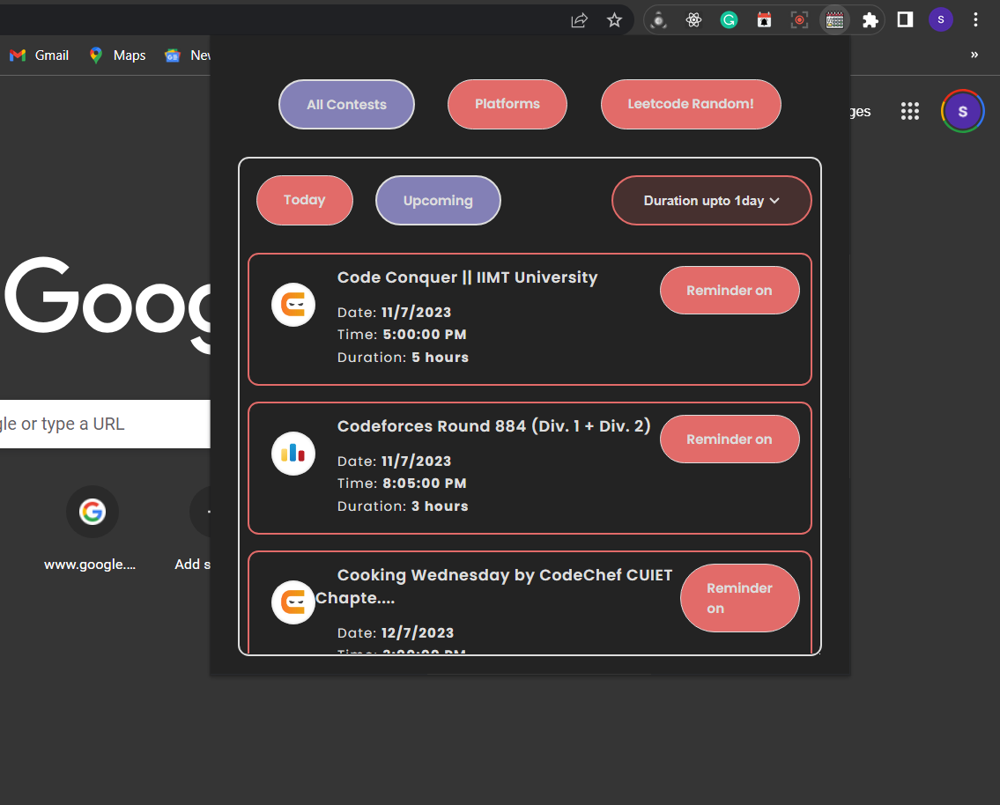
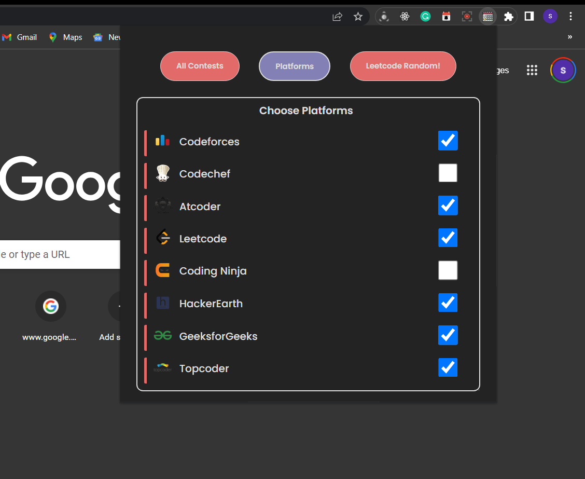
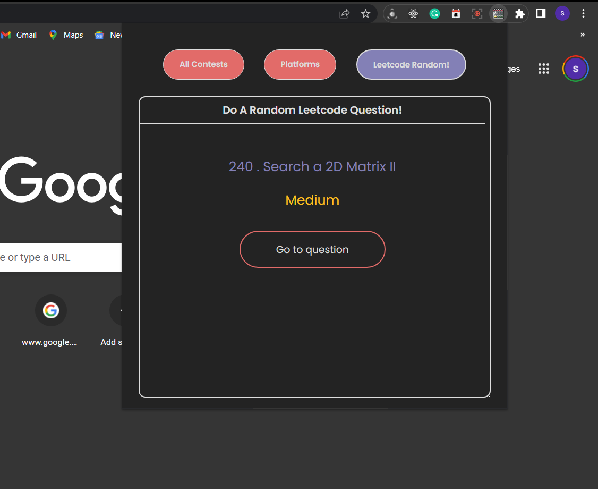

# Contest calender
#### This is a Chrome Extension that provides information about all upcoming Competitive programming contests across various coding platforms.
#### While tracking contests it enables the user to practice a randomly generated LeetCode question to brush up on Data structure and  algorithms.

The contest calendar (with Leetcode random question generator) is a Chrome Extension built on Manifest v2 technologies.

It fetches the data on all the scheduled contests over various platforms (Codeforces, Codechef, Atcoder, Leetcode, Coding Ninja, HackerEarth, GeeksforGeeks and Topcoder) and provides the user with the date, time and duration of these contests in a consolidated manner.

To help the users brush up on the Data science algorithms, a Leetcode random feature was implemented by web-scrapping Leetcode top 100 questions using Python and rendering using D3.

## Tech-Stack used :

  
  
  
  
  

## Test Chrome Extension

To test, go to chrome://extensions, enable Developer mode and load the app as an unpacked extension.

Need more information about Chrome Extension? Please visit [Google Chrome Extension Development](http://developer.chrome.com/extensions/devguide.html)

## D3 documentation

https://github.com/d3/d3.github.com

